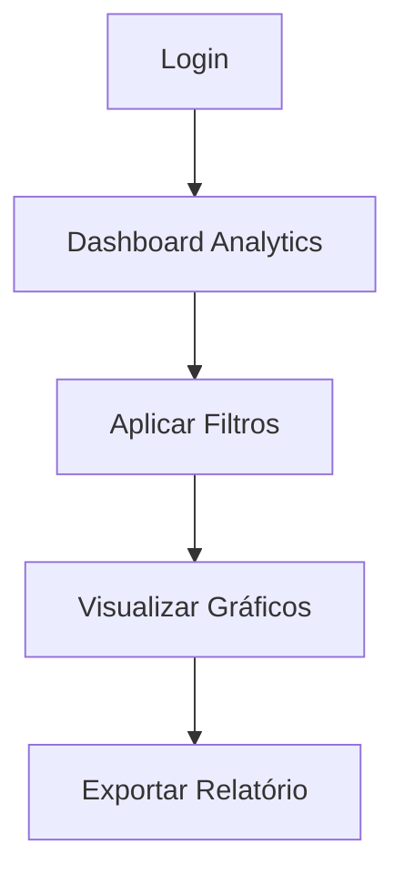

## 1. Product Overview
Página de Analytics para monitoramento do índice de intenção silenciosa, permitindo visualização de métricas e filtros por período e empresa. Acesso restrito para administradores e gestores.

## 2. Core Features

### 2.1 User Roles
| Role | Registration Method | Core Permissions |
|------|---------------------|------------------|
| Admin | Sistema interno | Acesso completo a todos os dados e funcionalidades |
| Corporate Manager | Convite/Criação por admin | Visualização de dados da empresa corporativa |
| Approver Manager | Convite/Criação por admin | Visualização e aprovação de métricas |

### 2.2 Feature Module
Nosso sistema de analytics consiste nos seguintes elementos principais:
1. **Dashboard Analytics**: visualização do índice de intenção silenciosa, gráficos de tendências, filtros dinâmicos.
2. **Filtros e Exportação**: seleção de período, empresa, exportação de relatórios.

### 2.3 Page Details
| Page Name | Module Name | Feature description |
|-----------|-------------|---------------------|
| Dashboard Analytics | Métricas Principais | Exibir índice de intenção silenciosa em tempo real com valor atual e variação percentual |
| Dashboard Analytics | Gráficos de Tendência | Mostrar evolução do índice em gráfico de linha com período selecionado |
| Dashboard Analytics | Filtros de Período | Permitir seleção de datas com calendário (últimos 7, 30, 90 dias ou personalizado) |
| Dashboard Analytics | Filtro por Empresa | Listar empresas disponíveis baseadas no papel do usuário logado |
| Dashboard Analytics | Exportação | Gerar relatório PDF/Excel com os dados filtrados atuais |
| Dashboard Analytics | Cards Informativos | Exibir resumo com total de denúncias, taxa de crescimento e comparativos |

## 3. Core Process
O usuário acessa o sistema através de login autenticado. Após autenticação, é redirecionado para o Dashboard Analytics onde visualiza o índice de intenção silenciosa. Pode aplicar filtros por período e empresa, visualizar gráficos interativos e exportar relatórios. O acesso aos dados é restrito conforme o perfil do usuário.

## 4. User Interface Design

### 4.1 Design Style
- Cores primárias: Azul escuro (#1e40af) e branco
- Cores secundárias: Verde (#10b981) para valores positivos, Vermelho (#ef4444) para negativos
- Botões: Estilo arredondado com sombra sutil
- Fonte: Inter, tamanhos 14px para texto, 24px para títulos
- Layout: Card-based com grid responsivo
- Ícones: Material Design Icons

### 4.2 Page Design Overview
| Page Name | Module Name | UI Elements |
|-----------|-------------|-------------|
| Dashboard Analytics | Header | Logo, nome do usuário, botão logout, fundo azul escuro |
| Dashboard Analytics | Cards Métricas | Cards brancos arredondados com borda sutil, valores em fonte grande e bold |
| Dashboard Analytics | Gráfico Principal | Área com fundo branco, altura 400px, grid e legendas visíveis |
| Dashboard Analytics | Filtros | Select dropdowns arredondados, botão primário azul para aplicar |
| Dashboard Analytics | Tabela Dados | Striped rows, hover effect, paginação na parte inferior |

### 4.3 Responsiveness
Desktop-first com adaptação para tablets e mobile. Em telas menores, cards empilham verticalmente e gráficos se ajustam automaticamente. Touch-friendly nos elementos interativos.