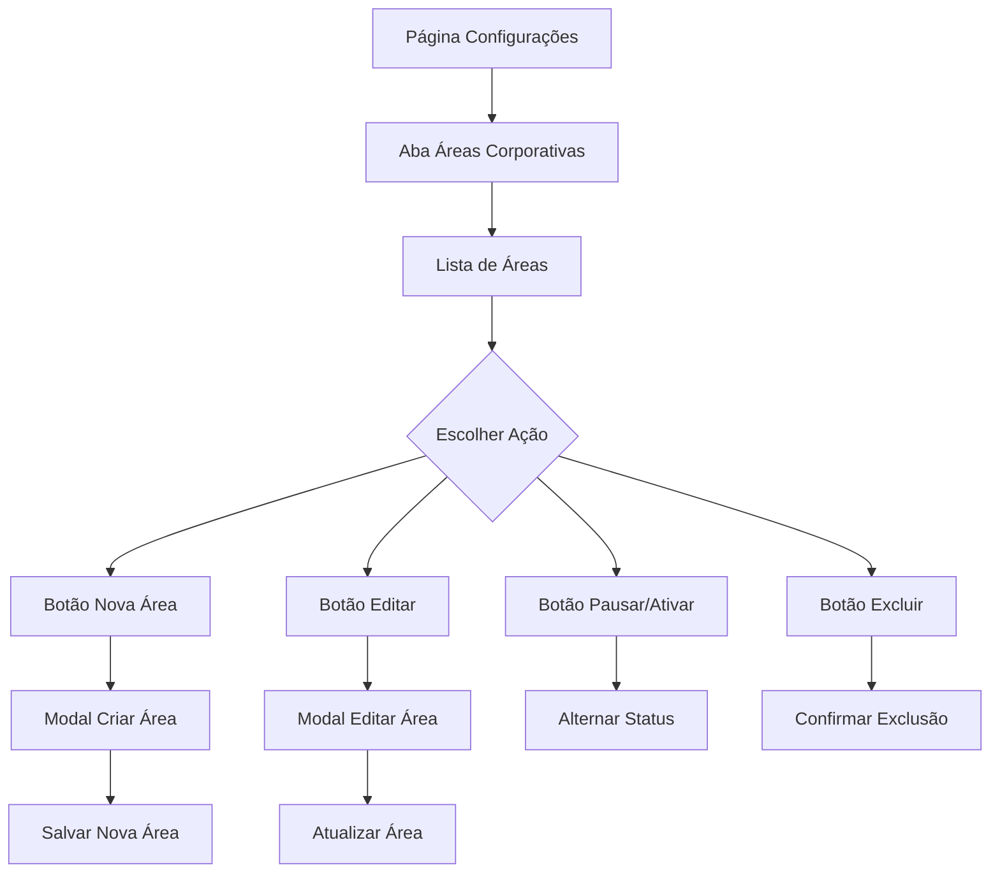

## 1. Visão Geral do Produto
Página de gerenciamento de áreas corporativas para administração do sistema de denúncias. Permite que administradores criem, editem, excluam e pausem departamentos/áreas da organização.

## 2. Funcionalidades Principais

### 2.1 Papéis de Usuário
| Papel | Método de Registro | Permissões Principais |
|------|---------------------|------------------|
| Administrador | Cadastro interno pelo sistema | Criar, editar, excluir e pausar áreas corporativas |
| Usuário Comum | Cadastro via formulário | Visualizar áreas disponíveis ao fazer denúncia |

### 2.2 Módulos de Funcionalidades
Nosso sistema de áreas corporativas consiste nas seguintes páginas principais:
1. **Página de Áreas Corporativas**: Lista de departamentos, botões de ação (criar, editar, excluir, pausar), status de cada área.
2. **Modal de Criar/Editar Área**: Formulário com campo de nome, botões de salvar/cancelar.

### 2.3 Detalhes das Páginas
| Nome da Página | Nome do Módulo | Descrição da Funcionalidade |
|-----------|-------------|---------------------|
| Áreas Corporativas | Lista de Áreas | Exibir todas as áreas em formato de tabela/lista com nome e status. Mostrar áreas ativas e pausadas com indicadores visuais diferentes. |
| Áreas Corporativas | Botões de Ação | Incluir botão "Nova Área" no topo da página. Para cada área: ícone/botão de editar, excluir e alternar status (ativar/pausar). |
| Áreas Corporativas | Indicadores de Status | Mostrar badge/coloração diferente para áreas ativas (verde) e pausadas (cinza). Atualizar em tempo real após ações. |
| Modal Criar/Editar | Formulário | Campo de texto para nome da área (obrigatório, máximo 100 caracteres). Botões de salvar e cancelar. Validação de campo obrigatório. |
| Modal Criar/Editar | Ações do Formulário | Salvar nova área ou atualizar existente. Fechar modal após sucesso. Mostrar mensagem de confirmação. |

## 3. Fluxo Principal
Administrador acessa a página de configurações → seleciona aba "Áreas Corporativas" → visualiza lista existente → pode criar nova área, editar nome, pausar/reativar ou excluir áreas.

## 4. Interface do Usuário

### 4.1 Estilo de Design
- Cores principais: Azul/teal para elementos ativos (igual à aba selecionada)
- Cores secundárias: Cinza para elementos desativados/pausados
- Estilo de botões: Retangulares com bordas arredondadas, sombra sutil
- Fonte: Sans-serif, tamanho 14px para texto, 16px para títulos
- Layout: Baseado em cards/tabela com linhas separadoras claras
- Ícones: Estilo minimalista, cores sólidas

### 4.2 Visão Geral do Design das Páginas
| Nome da Página | Nome do Módulo | Elementos de UI |
|-----------|-------------|-------------|
| Áreas Corporativas | Lista de Áreas | Tabela com linhas alternadas em branco e cinza muito claro. Nome da área em texto preto, status com badge colorido. Largura total da tela. |
| Áreas Corporativas | Botões de Ação | Botão "Nova Área" azul/teal no canto superior direito. Ícones de lápis (editar), pausar/play, lixeira (excluir) em cada linha. Ícones cinza que mudam para azul ao passar mouse. |
| Modal Criar/Editar | Formulário | Campo de entrada com label "Nome da Área" acima. Botões "Salvar" (azul) e "Cancelar" (branco com borda cinza) alinhados à direita. |

### 4.3 Responsividade
Design desktop-first com adaptação para mobile. Em telas pequenas, tabela vira lista vertical com cards. Manter botões de ação acessíveis em telas touch.