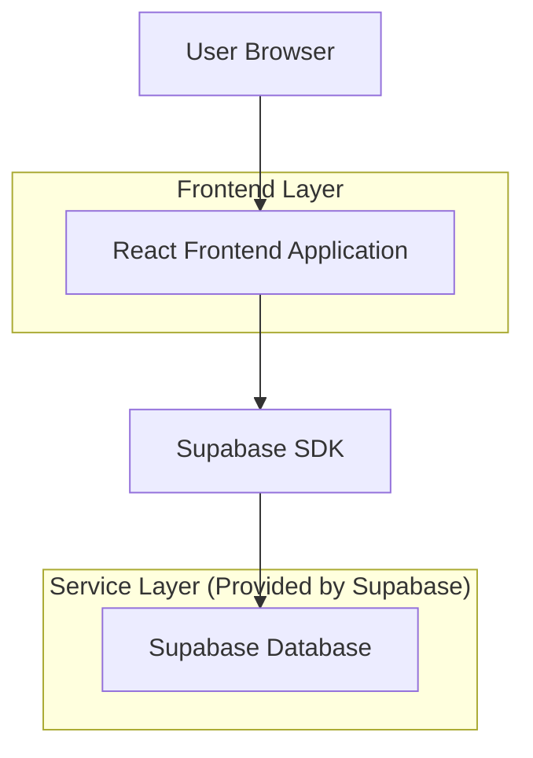
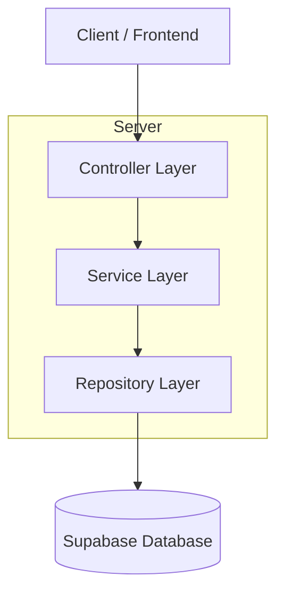
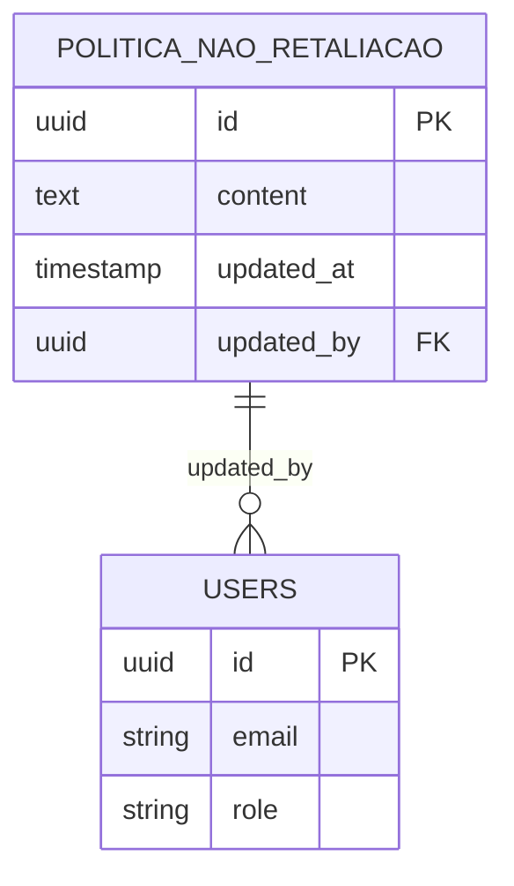

## 1. Architecture design



## 2. Technology Description
- Frontend: React@18 + tailwindcss@3 + vite
- Initialization Tool: vite-init
- Backend: Supabase (PostgreSQL)
- Editor: react-quill ou similar para editor WYSIWYG

## 3. Route definitions
| Route | Purpose |
|-------|---------|
| /configuracoes/politica-nao-retaliacao | Página de gestão da política de não retaliação |
| /configuracoes | Página principal de configurações com abas |

## 4. API definitions
### 4.1 Core API

Política de Não Retaliação
```
GET /api/politica-nao-retaliacao
```

Response:
| Param Name| Param Type  | Description |
|-----------|-------------|-------------|
| content   | string      | Conteúdo HTML da política |
| updated_at| timestamp  | Data da última atualização |
| updated_by| string      | ID do usuário que atualizou |

```
PUT /api/politica-nao-retaliacao
```

Request:
| Param Name| Param Type  | isRequired  | Description |
|-----------|-------------|-------------|-------------|
| content   | string      | true        | Conteúdo HTML da política |

## 5. Server architecture diagram


## 6. Data model

### 6.1 Data model definition


### 6.2 Data Definition Language
Política Não Retaliação Table (politica_nao_retaliacao)
```sql
-- create table
CREATE TABLE politica_nao_retaliacao (
    id UUID PRIMARY KEY DEFAULT gen_random_uuid(),
    content TEXT NOT NULL,
    updated_at TIMESTAMP WITH TIME ZONE DEFAULT NOW(),
    updated_by UUID REFERENCES auth.users(id),
    created_at TIMESTAMP WITH TIME ZONE DEFAULT NOW()
);

-- create index
CREATE INDEX idx_politica_updated_at ON politica_nao_retaliacao(updated_at DESC);

-- grant permissions
GRANT SELECT ON politica_nao_retaliacao TO anon;
GRANT ALL PRIVILEGES ON politica_nao_retaliacao TO authenticated;

-- Row Level Security (RLS) policies
ALTER TABLE politica_nao_retaliacao ENABLE ROW LEVEL SECURITY;

-- Allow read access to all users
CREATE POLICY "Allow read access" ON politica_nao_retaliacao
    FOR SELECT USING (true);

-- Allow update only to authenticated users
CREATE POLICY "Allow update for authenticated" ON politica_nao_retaliacao
    FOR UPDATE USING (auth.role() = 'authenticated')
    WITH CHECK (auth.role() = 'authenticated');
```