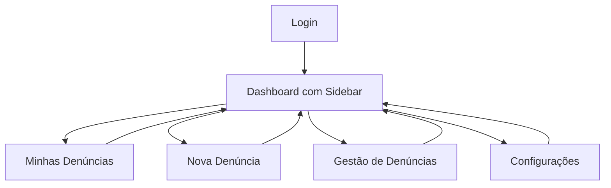

## 1. Visão Geral do Produto

Refatoração do menu de navegação do sistema ATLAS - Sistema corporativo de denúncias e governança, transformando o menu horizontal atual em uma sidebar moderna, tecnológica e responsiva.

## 2. Recursos Principais

### 2.1 Módulo de Funcionalidades

**Requisitos consistem na refatoração do menu de navegação:**

1. **Sidebar moderna**: menu lateral colapsável com design tecnológico
2. **Header ajustado**: barra superior adaptada ao novo layout
3. **Dashboard principal**: ajustes de layout para compatibilidade com sidebar

### 2.2 Detalhes das Funcionalidades

| Nome da Página | Nome do Módulo      | Descrição da Funcionalidade                                                                          |
| -------------- | ------------------- | ---------------------------------------------------------------------------------------------------- |
| Sidebar Menu   | Navegação principal | Implementar menu lateral com ícones modernos, colapsável, destacando item ativo com indicador visual |
| Header System  | Barra superior      | Redesenhar header para se integrar com sidebar, mantendo informações do usuário e botão sair         |
| Dashboard      | Página principal    | Ajustar layout do dashboard para novo espaço disponível, mantendo cards e gráficos                   |

## 3. Processo Principal

**Fluxo de Navegação:**

* Usuário acessa o sistema → Sidebar expandida por padrão → Pode colapsar para ícones apenas → Navegação entre seções preservada → Indicador visual de página ativa → Botão sair acessível

## 4. Design de Interface

### 4.1 Estilo de Design

* **Cores primárias**: Azul tecnológico (#2563EB) para elementos ativos

* **Cores secundárias**: Cinza escuro (#1F2937) para sidebar, branco (#FFFFFF) para conteúdo

* **Estilo de botões**: Minimalista com ícones lineares modernos

* **Tipografia**: Fonte sans-serif limpa (Inter ou similar), tamanhos 14-16px para menu

* **Layout**: Sidebar fixa com animações suaves de colapso

* **Ícones**: Estilo line-outline, consistentes com design moderno

### 4.2 Visão Geral do Design das Páginas

| Nome da Página | Nome do Módulo     | Elementos de UI                                                                               |
| -------------- | ------------------ | --------------------------------------------------------------------------------------------- |
| Sidebar Menu   | Menu lateral       | Largura 250px expandida / 80px colapsada, ícones 24px, hover effects, indicador ativo em azul |
| Header System  | Barra superior     | Altura 64px, logo ATLAS alinhado à esquerda, info usuário à direita, botão sair com ícone     |
| Dashboard      | Conteúdo principal | Cards responsivos adaptados ao novo espaço, mantendo métricas e gráficos existentes           |

### 4.3 Responsividade

* **Desktop-first**: Sidebar sempre visível em telas > 1024px

* **Mobile**: Sidebar vira menu hamburger com overlay

* **Touch optimization**: Áreas de toque mínimas 44px para mobile

### 4.4 Animações e Interações

* Transição suave de colapso (300ms ease-in-out)

* Hover effects nos itens do menu

* Indicador de página ativa com animação de slide

* Overlay semi-transparente em mobile

