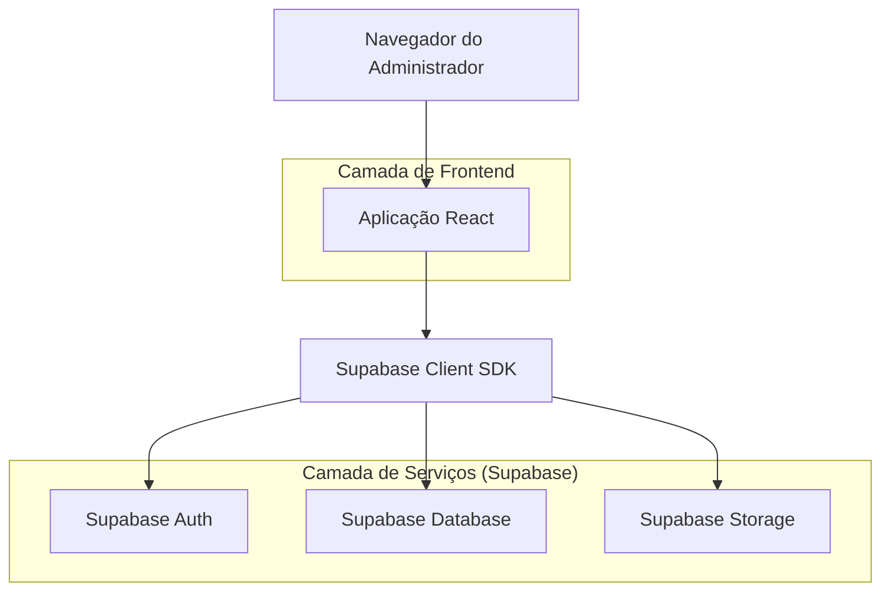
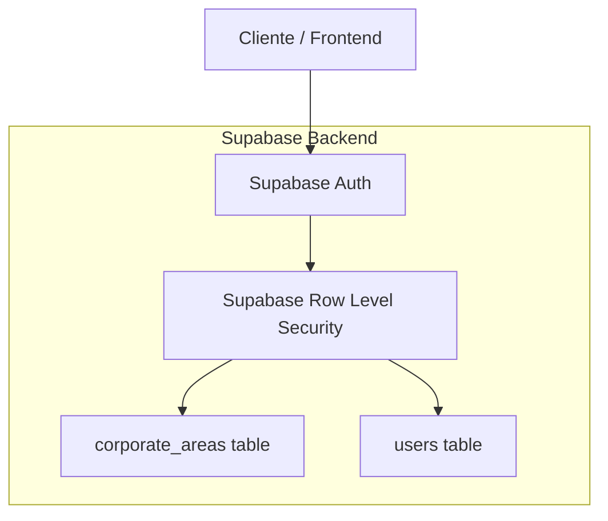
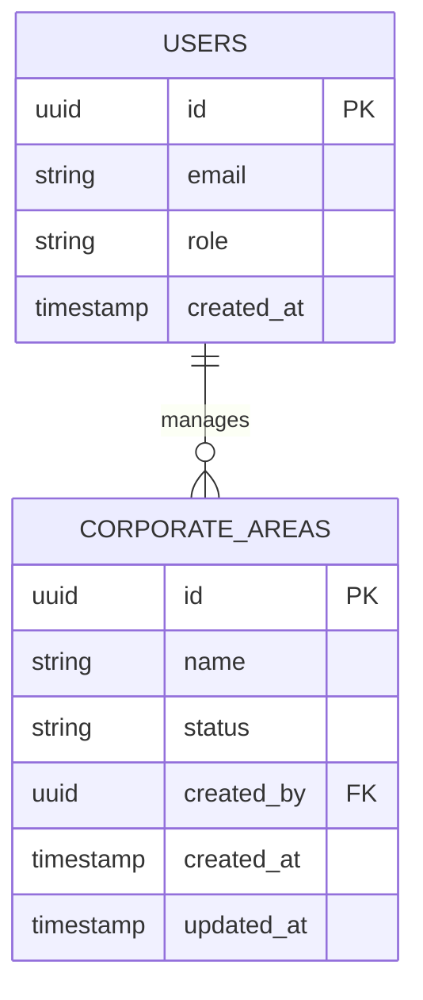

## 1. Arquitetura do Sistema



## 2. Descrição das Tecnologias

* Frontend: React\@18 + tailwindcss\@3 + vite

* Ferramenta de Inicialização: vite-init

* Backend: Supabase (PostgreSQL + Auth + Storage)

* Bibliotecas: @supabase/supabase-js\@2

## 3. Definições de Rotas

| Rota                 | Propósito                                                    |
| -------------------- | ------------------------------------------------------------ |
| /configuracoes/areas | Página de gerenciamento de áreas corporativas (admin apenas) |
| /configuracoes       | Página principal de configurações com abas                   |

## 4. Definições de API

### 4.1 Operações com Áreas Corporativas

```
GET /rest/v1/corporate_areas
```

**Headers:** Authorization: Bearer {token}
**Response:** Array de objetos de áreas

```
POST /rest/v1/corporate_areas
```

**Headers:** Authorization: Bearer {token}
**Body:** { name: string, status: 'active' | 'paused' }

```
PATCH /rest/v1/corporate_areas?id=eq.{id}
```

**Headers:** Authorization: Bearer {token}
**Body:** { name?: string, status?: 'active' | 'paused' }

```
DELETE /rest/v1/corporate_areas?id=eq.{id}
```

**Headers:** Authorization: Bearer {token}

## 5. Arquitetura do Servidor



## 6. Modelo de Dados

### 6.1 Definição do Modelo de Dados



### 6.2 Linguagem de Definição de Dados

**Tabela de Áreas Corporativas (corporate\_areas)**

```sql
-- criar tabela
CREATE TABLE corporate_areas (
    id UUID PRIMARY KEY DEFAULT gen_random_uuid(),
    name VARCHAR(100) NOT NULL UNIQUE,
    status VARCHAR(20) DEFAULT 'active' CHECK (status IN ('active', 'paused')),
    created_by UUID REFERENCES auth.users(id),
    created_at TIMESTAMP WITH TIME ZONE DEFAULT NOW(),
    updated_at TIMESTAMP WITH TIME ZONE DEFAULT NOW()
);

-- criar índices
CREATE INDEX idx_corporate_areas_status ON corporate_areas(status);
CREATE INDEX idx_corporate_areas_name ON corporate_areas(name);

-- permissões básicas
GRANT SELECT ON corporate_areas TO anon;
GRANT ALL PRIVILEGES ON corporate_areas TO authenticated;

-- políticas de segurança
CREATE POLICY "Admin pode gerenciar áreas" ON corporate_areas
    FOR ALL TO authenticated
    USING (auth.jwt() ->> 'role' = 'admin')
    WITH CHECK (auth.jwt() ->> 'role' = 'admin');

-- dados iniciais - Áreas do primeiro print
INSERT INTO corporate_areas (name, status) VALUES
('Logística', 'active'),
('Inovação / Produtos Digitais', 'active'),
('Saúde Ocupacional / SST', 'active'),
('Engenharia', 'active'),
('Auditoria', 'active'),
('Planejamento Estratégico', 'active'),
('Comercial', 'active'),
('Recursos Humanos', 'active'),
('Patrimônio', 'active'),
('Sustentabilidade', 'active'),
('Jurídico', 'active'),
('Atendimento / SAC', 'active'),
('Produção', 'active'),
('Controladoria', 'active'),
('Contabilidade', 'active'),
('Treinamento & Desenvolvimento', 'active'),
('Saúde Corporativa', 'active'),
('Manutenção', 'active'),
('Suprimentos', 'active'),
('Comunicação', 'active');

-- dados iniciais - Áreas do segundo print
INSERT INTO corporate_areas (name, status) VALUES
('Vendas', 'active'),
('Marketing', 'active'),
('Facilities', 'active'),
('Operações', 'active'),
('Melhoria Contínua', 'active'),
('Financeiro', 'active'),
('Qualidade', 'active'),
('Compras/Logística', 'active'),
('Compliance', 'active'),
('Pós-Vendas / Customer Success', 'active'),
('PMO / Projetos', 'active'),
('Administrativo', 'active'),
('Serviços Gerais', 'active'),
('Pesquisa & Desenvolvimento (P&D)', 'active'),
('Diretoria Executiva', 'active'),
('Departamento Pessoal', 'active'),
('Tecnologia da Informação (TI)', 'active');
```

