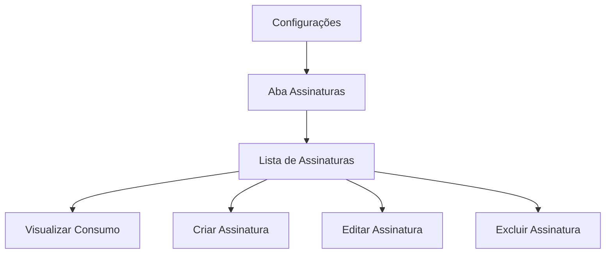

## 1. Product Overview
Sistema de gerenciamento de assinaturas para administradores. Permite controle completo sobre planos de assinatura das empresas, com visualização de uso em tempo real.
- Resolve o problema de administração manual de assinaturas e acompanhamento de consumo por empresa.
- Usado exclusivamente por administradores do sistema.
- Ajuda no controle financeiro e operacional das assinaturas vigentes.

## 2. Core Features

### 2.1 User Roles
| Role | Registration Method | Core Permissions |
|------|---------------------|------------------|
| Admin | Sistema interno | Acesso completo à aba Assinaturas: visualizar, criar, editar, excluir assinaturas e ver consumo das empresas |

### 2.2 Feature Module
Nossa funcionalidade de Assinaturas consiste nos seguintes módulos principais:
1. **Aba Assinaturas**: listagem de assinaturas vigentes, formulário de criação/edição, visualização de consumo por empresa.

### 2.3 Page Details
| Page Name | Module Name | Feature description |
|-----------|-------------|---------------------|
| Configurações - Aba Assinaturas | Lista de Assinaturas | Exibir todas as assinaturas vigentes com status, empresa associada, plano e data de vencimento |
| Configurações - Aba Assinaturas | Visualizar Consumo | Mostrar uso atual da empresa (denúncias realizadas, limite do plano, percentual de uso) no momento da consulta |
| Configurações - Aba Assinaturas | Criar Assinatura | Formulário para cadastrar nova assinatura com seleção de empresa, plano, data de início e vencimento |
| Configurações - Aba Assinaturas | Editar Assinatura | Modificar dados existentes da assinatura (plano, datas, status) |
| Configurações - Aba Assinaturas | Excluir Assinatura | Remover assinatura do sistema com confirmação de segurança |
| Configurações - Aba Assinaturas | Filtros e Busca | Filtrar assinaturas por empresa, status, data de vencimento |

## 3. Core Process
**Admin Flow**: O administrador acessa Configurações → Aba Assinaturas → Visualiza lista de assinaturas vigentes → Pode criar nova assinatura preenchendo formulário → Pode clicar em assinatura existente para editar ou excluir → Visualiza consumo da empresa em tempo real durante a consulta.

## 4. User Interface Design
### 4.1 Design Style
- Cores primárias: azul escuro (#1e40af) para headers, branco (#ffffff) para fundo
- Botões: estilo arredondado com hover effects
- Fonte: Inter, tamanhos 14px para texto, 16px para headers
- Layout: tabela para listagem, cards para formulários, sidebar para navegação
- Ícones: Material Design icons para ações (visualizar, editar, excluir)

### 4.2 Page Design Overview
| Page Name | Module Name | UI Elements |
|-----------|-------------|-------------|
| Aba Assinaturas | Lista de Assinaturas | Tabela responsiva com colunas: Empresa, Plano, Status, Data Vencimento, Ações (ícones de visualizar/editar/excluir), cor verde para ativas, vermelho para vencidas |
| Aba Assinaturas | Formulário Assinatura | Card centralizado com campos: Select empresa, Select plano, DatePicker data início, DatePicker data vencimento, Toggle status, botões Salvar/Cancelar |
| Aba Assinaturas | Modal Consumo | Popup ao clicar em "Visualizar Consumo" mostrando: progress bar com uso atual, número de denúncias, limite do plano, percentual de uso |

### 4.3 Responsiveness
Desktop-first com adaptação mobile. Tabela horizontal scroll em telas pequenas, formulários em layout vertical empilh