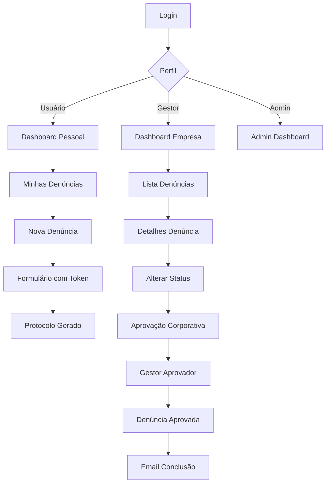

## 1. Product Overview
Sistema de Canal de Denúncias Corporativas multi-tenant que permite colaboradores realizarem denúncias de forma anônima ou identificada. O sistema oferece dashboard com KPIs, classificação automática de risco e fluxo seguro com token dedicado para novas denúncias.

**Problema resolvido:** Violações éticas e legais em empresas não são reportadas devido ao medo de retaliação. **Solução:** Canal seguro e anônimo para denúncias com gestão corporativa estruturada.

**Target:** Empresas de médio e grande porte que precisam cumprir compliance e LGPD.

## 2. Core Features

### 2.1 User Roles
| Role | Registration Method | Core Permissions |
|------|---------------------|------------------|
| Administrador | Manual system creation | Full system access, manage companies and users |
| Gestor Corporativo | Invitation by Admin | View all company reports, change status, add comments |
| Gestor Aprovador | Invitation by Admin | All Corporate Manager permissions + approve/close reports |
| Usuário Denunciante | Self-registration via invitation | Create reports, view own reports only |

### 2.2 Feature Module
O sistema consiste nas seguintes páginas principais:

1. **Página de Login**: autenticação com email/senha, recuperação de senha
2. **Dashboard**: KPIs de denúncias por status, gráficos, métricas
3. **Minhas Denúncias**: lista de denúncias do usuário logado
4. **Nova Denúncia**: formulário com token de segurança
5. **Detalhes da Denúncia**: visualização completa com histórico
6. **Gestão de Denúncias**: painel administrativo para gestores
7. **Aprovação Corporativa**: fila de denúncias para aprovação final
8. **Administração**: gestão de empresas, usuários e configurações

### 2.3 Page Details
| Page Name | Module Name | Feature description |
|-----------|-------------|---------------------|
| Login | Autenticação | Validar email/senha, link para recuperação de senha |
| Dashboard | KPIs | Exibir total de denúncias, por status, gráfico temporal |
| Dashboard | Filtros | Filtrar por período, tipo, status, nível de risco |
| Minhas Denúncias | Lista | Mostrar protocolo, data, status, resumo das denúncias |
| Minhas Denúncias | Ações | Criar nova denúncia, visualizar detalhes, adicionar comentários |
| Nova Denúncia | Token | Gerar link único com token de segurança |
| Nova Denúncia | Formulário | Identificação opcional, área, motivo/submotivo, perguntas estruturadas |
| Nova Denúncia | Anexos | Permitir upload de arquivos com limite configurável |
| Detalhes Denúncia | Visualização | Mostrar todos os dados, histórico de status, anexos |
| Detalhes Denúncia | Comentários | Adicionar comentários, visualizar perfil do autor (sem nome) |
| Gestão Denúncias | Lista | Visualizar todas as denúncias da empresa |
| Gestão Denúncias | Status | Alterar status, adicionar anexos, registrar andamentos |
| Aprovação Corporativa | Fila | Listar denúncias aguardando aprovação final |
| Aprovação Corporativa | Aprovação | Aprovar denúncia, adicionar texto final, enviar email |
| Administração | Empresas | Criar/editar empresas, definir configurações |
| Administração | Usuários | Convidar usuários, definir perfis, gerenciar acessos |

## 3. Core Process

### Fluxo do Denunciante
1. Usuário recebe convite por email e se cadastra
2. Acessa dashboard com suas métricas
3. Clica em "Nova Denúncia" e recebe link com token
4. Acessa link, digita token, preenche formulário
5. Recebe protocolo por email
6. Acompanha status em "Minhas Denúncias"
7. Adiciona comentários/anexos enquanto não concluída
8. Recebe email quando denúncia é concluída

### Fluxo do Gestor
1. Gestor Corporativo acessa dashboard da empresa
2. Visualiza lista de denúncias com filtros
3. Abre denúncia para ver detalhes completos
4. Adiciona comentários e anexos
5. Altera status conforme andamento
6. Quando pronto, muda para "Aprovação Corporativa"
7. Gestor Aprovador acessa fila de aprovação
8. Revisa denúncia e aprova/encerra
9. Sistema envia email automático ao denunciante

## 4. User Interface Design

### 4.1 Design Style
- **Cores primárias**: Azul escuro (#1e40af) e cinza claro (#f8fafc)
- **Cores secundárias**: Verde sucesso (#10b981), Vermelho perigo (#ef4444)
- **Botões**: Estilo arredondado com sombra suave
- **Fonte**: Inter ou Roboto, tamanhos 14-16px para texto, 18-20px para títulos
- **Layout**: Card-based com navegação lateral para desktop, bottom navigation para mobile
- **Ícones**: Feather Icons ou Heroicons, estilo outline

### 4.2 Page Design Overview
| Page Name | Module Name | UI Elements |
|-----------|-------------|-------------|
| Login | Form | Card centralizado com inputs arredondados, botão primário azul, link para recuperação |
| Dashboard | KPI Cards | Cards coloridos com ícones, números grandes, gráfico de barras/timeline |
| Minhas Denúncias | Tabela | Tabela limpa com zebra striping, badges coloridos para status, botão ação primário |
| Nova Denúncia | Token | Card com QR code e link copiável, instruções claras em português |
| Formulário Denúncia | Steps | Wizard com progress bar, perguntas por etapa, validação em tempo real |
| Detalhes Denúncia | Timeline | Timeline vertical com status, cards para comentários, galeria de anexos |
| Gestão Denúncias | Filtros | Filtros laterais colapsáveis, tabela paginada, ações em dropdown |

### 4.3 Responsiveness
- **Desktop-first**: Otimizado para telas 1440px+
- **Mobile-adaptive**: Breakpoints em 768px e 480px
- **Touch optimization**: Botões mínimos 44px, swipe gestures para navegação
- **PWA**: Manifest.json para instalação, service worker para offline

### 4.4 Segurança Visual
- **Anonimato**: Ícone de máscara para denúncias anônimas
- **Status crítico**: Badge vermelho piscante para denúncias de alto risco
- **Confidencial**: Ícone de cadeado para informações restritas
- **Auditoria**: Ícone de histórico para todas as ações do sistema