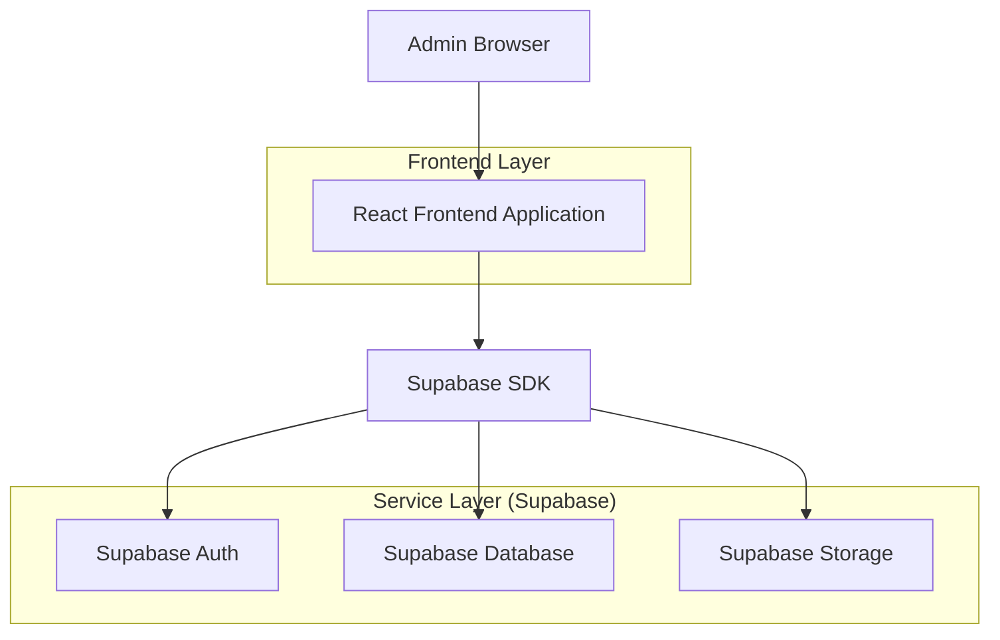
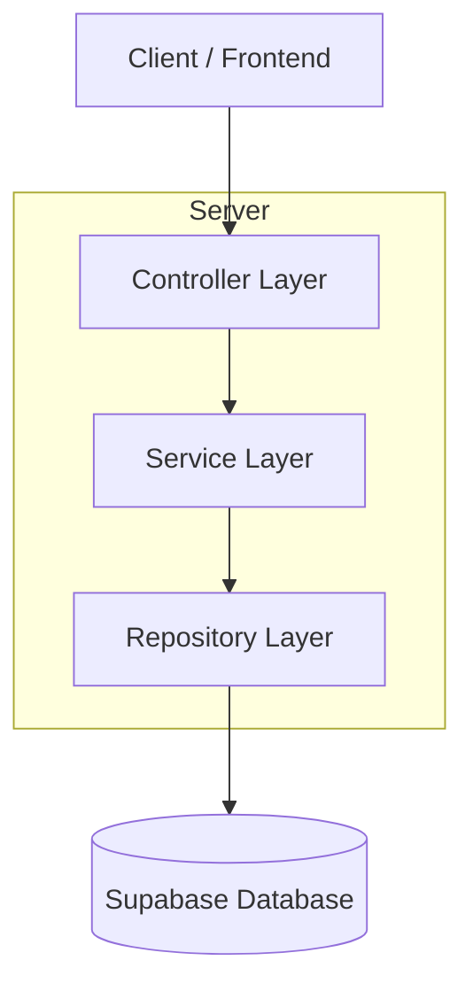
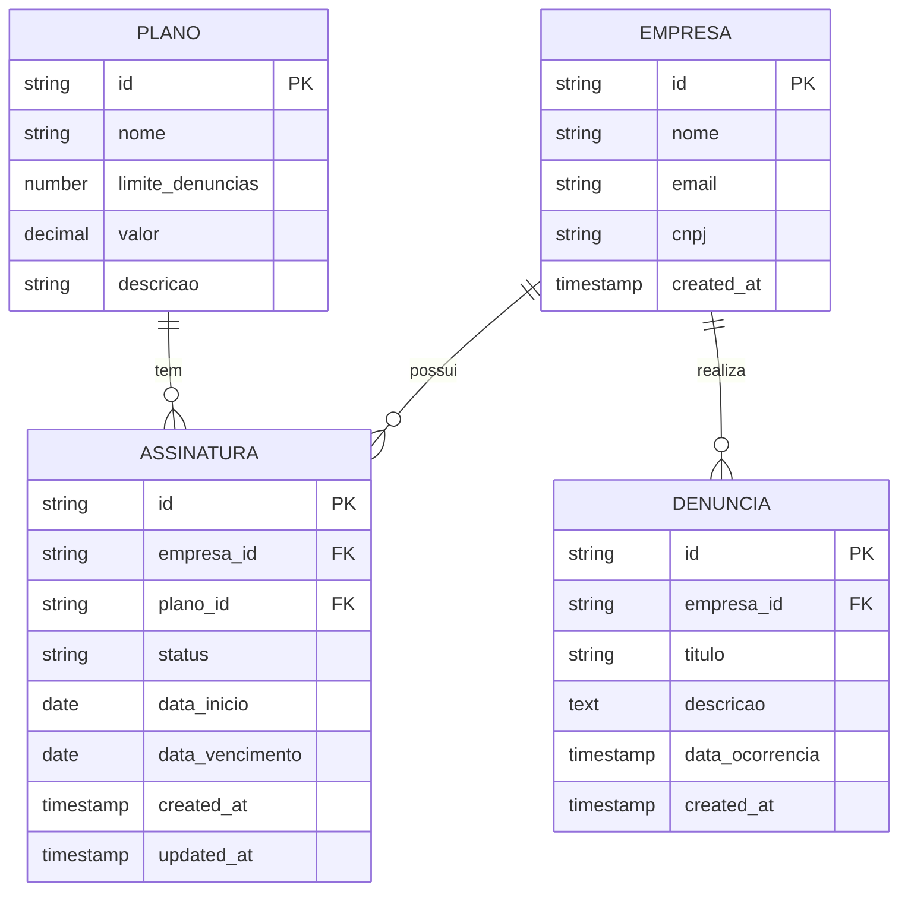

## 1. Architecture design



## 2. Technology Description
- Frontend: React@18 + tailwindcss@3 + vite
- Initialization Tool: vite-init
- Backend: Supabase (PostgreSQL + Auth + Storage)
- UI Components: HeadlessUI + Heroicons

## 3. Route definitions
| Route | Purpose |
|-------|---------|
| /admin/configuracoes/assinaturas | Página principal da aba Assinaturas, lista todas as assinaturas |
| /admin/configuracoes/assinaturas/nova | Formulário para criar nova assinatura |
| /admin/configuracoes/assinaturas/[id]/editar | Formulário para editar assinatura existente |

## 4. API definitions

### 4.1 Assinaturas API

Listar assinaturas
```
GET /api/assinaturas
```

Response:
| Param Name| Param Type  | Description |
|-----------|-------------|-------------|
| id        | string      | ID da assinatura |
| empresa_id| string      | ID da empresa |
| plano     | string      | Nome do plano |
| status    | string      | Status (ativa/vencida/cancelada) |
| data_inicio| date       | Data de início |
| data_vencimento| date   | Data de vencimento |

Criar assinatura
```
POST /api/assinaturas
```

Request:
| Param Name| Param Type  | isRequired  | Description |
|-----------|-------------|-------------|-------------|
| empresa_id| string     | true        | ID da empresa |
| plano     | string      | true        | Nome do plano |
| data_inicio| date       | true        | Data de início |
| data_vencimento| date   | true        | Data de vencimento |

Visualizar consumo
```
GET /api/assinaturas/[id]/consumo
```

Response:
| Param Name| Param Type  | Description |
|-----------|-------------|-------------|
| denuncias_realizadas| number | Total de denúncias no período |
| limite_plano| number   | Limite máximo do plano |
| percentual_uso| number | Percentual de uso (0-100) |

## 5. Server architecture diagram


## 6. Data model

### 6.1 Data model definition


### 6.2 Data Definition Language

Tabela de Assinaturas (assinaturas)
```sql
-- create table
CREATE TABLE assinaturas (
    id UUID PRIMARY KEY DEFAULT gen_random_uuid(),
    empresa_id UUID NOT NULL REFERENCES empresas(id),
    plano_id UUID NOT NULL REFERENCES planos(id),
    status VARCHAR(20) NOT NULL DEFAULT 'ativa' CHECK (status IN ('ativa', 'vencida', 'cancelada')),
    data_inicio DATE NOT NULL,
    data_vencimento DATE NOT NULL,
    created_at TIMESTAMP WITH TIME ZONE DEFAULT NOW(),
    updated_at TIMESTAMP WITH TIME ZONE DEFAULT NOW()
);

-- create indexes
CREATE INDEX idx_assinaturas_empresa_id ON assinaturas(empresa_id);
CREATE INDEX idx_assinaturas_status ON assinaturas(status);
CREATE INDEX idx_assinaturas_data_vencimento ON assinaturas(data_vencimento);

-- grant permissions
GRANT SELECT ON assinaturas TO anon;
GRANT ALL PRIVILEGES ON assinaturas TO authenticated;

-- RLS policies
CREATE POLICY "Admin pode ver todas assinaturas" ON assinaturas
    FOR SELECT TO authenticated
    USING (auth.jwt() ->> 'role' = 'admin');

CREATE POLICY "Admin pode criar assinaturas" ON assinaturas
    FOR INSERT TO authenticated
    WITH CHECK (auth.jwt() ->> 'role' = 'admin');

CREATE POLICY "Admin pode atualizar assinaturas" ON assinaturas
    FOR UPDATE TO authenticated
    USING (auth.jwt() ->> 'role' = 'admin');

CREATE POLICY "Admin pode deletar assinaturas" ON assinaturas
    FOR DELETE TO authenticated
    USING (auth.jwt() ->> 'role' = 'admin');
```

View para consumo de denúncias por empresa
```sql
CREATE VIEW empresa_consumo AS
SELECT 
    e.id as empresa_id,
    e.nome as empresa_nome,
    a.plano_id,
    p.limite_denuncias,
    COUNT(d.id) as denuncias_realizadas,
    ROUND((COUNT(d.id)::decimal / p.limite_denuncias * 100), 2) as percentual_uso
FROM empresas e
LEFT JOIN assinaturas a ON e.id = a.empresa_id AND a.status = 'ativa'
LEFT JOIN planos p ON a.plano_id = p.id
LEFT JOIN denuncias d ON e.id = d.empresa_id 
    AND d.created_at >= a.data_inicio 
    AND d.created_at <= a.data_vencimento
GROUP BY e.id, e.nome, a.plano_id, p.limite_denuncias;

GRANT SELECT ON empresa_consumo TO authenticated;
```