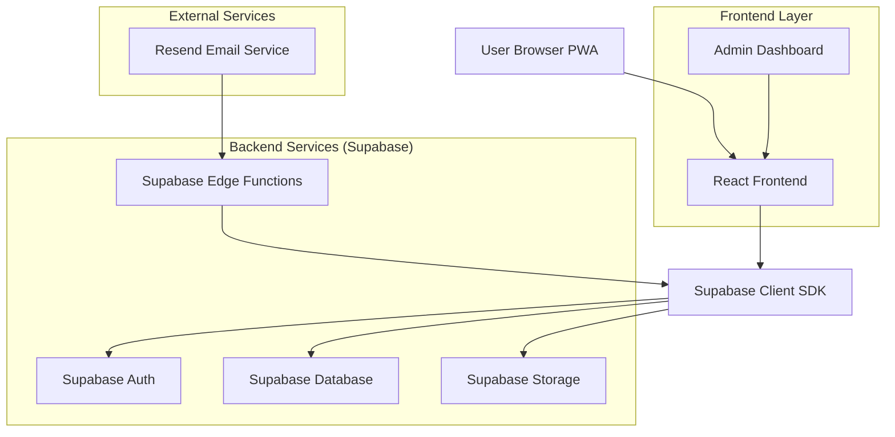
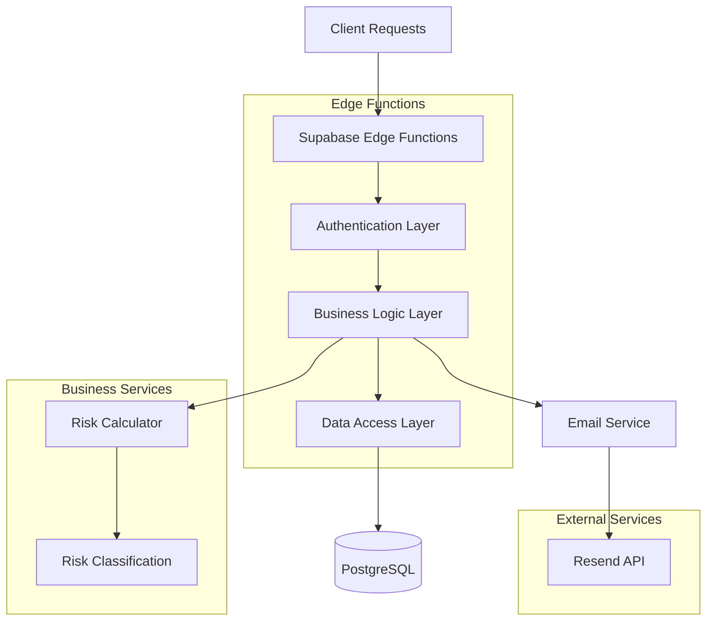
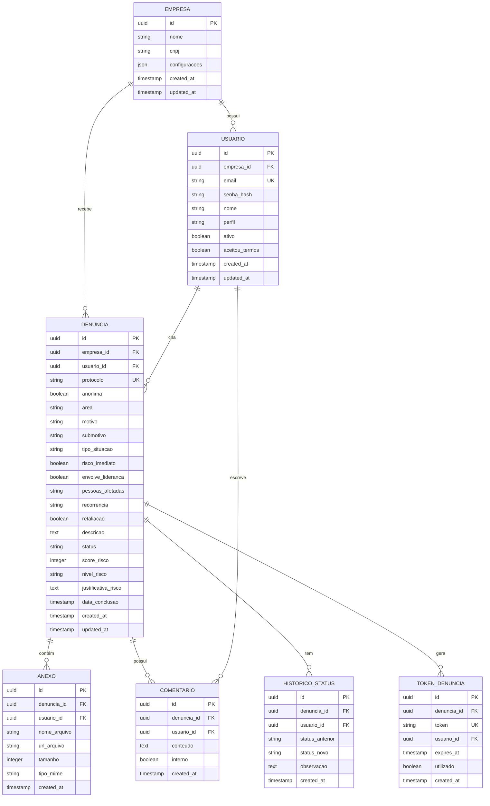

## 1. Architecture design



## 2. Technology Description
- **Frontend**: React@18 + TypeScript + TailwindCSS@3 + Vite
- **Initialization Tool**: vite-init
- **Backend**: Supabase (PostgreSQL, Auth, Storage, Edge Functions)
- **Email Service**: Resend via Supabase Edge Functions
- **PWA**: Vite PWA Plugin with offline support
- **State Management**: React Context + Supabase Real-time
- **Form Validation**: React Hook Form + Zod
- **Charts**: Chart.js ou Recharts para dashboards

## 3. Route definitions
| Route | Purpose |
|-------|---------|
| /login | Página de autenticação com email/senha |
| /dashboard | Dashboard inicial com KPIs personalizados |
| /minhas-denuncias | Lista de denúncias do usuário logado |
| /nova-denuncia | Gerar link/token para nova denúncia |
| /denuncia/:token | Formulário de denúncia com validação de token |
| /denuncia/detalhes/:id | Visualizar detalhes de uma denúncia específica |
| /gestao-denuncias | Painel administrativo de denúncias |
| /aprovacao-corporativa | Fila de denúncias para aprovação final |
| /admin/empresas | Gestão de empresas (Admin only) |
| /admin/usuarios | Gestão de usuários e perfis (Admin only) |
| /configuracoes | Configurações do sistema |

## 4. API definitions

### 4.1 Authentication APIs
```
POST /auth/login
```
Request:
```json
{
  "email": "usuario@empresa.com",
  "password": "senha123"
}
```
Response:
```json
{
  "user": {
    "id": "uuid",
    "email": "usuario@empresa.com",
    "profile": "usuario|gestor_corporativo|gestor_aprovador|admin",
    "company_id": "uuid"
  },
  "session": "jwt_token"
}
```

### 4.2 Report Management APIs
```
POST /api/denuncias/criar-token
```
Request:
```json
{
  "user_id": "uuid",
  "company_id": "uuid"
}
```
Response:
```json
{
  "token": "abc123-def456",
  "link": "https://app.com/denuncia/abc123-def456",
  "expires_at": "2024-01-15T10:00:00Z"
}
```

```
POST /api/denuncias/validar-token
```
Request:
```json
{
  "token": "abc123-def456"
}
```

```
POST /api/denuncias/submeter
```
Request:
```json
{
  "token": "abc123-def456",
  "identificar": false,
  "area": "RH",
  "motivo": "Assédio",
  "submotivo": "Assédio Sexual",
  "tipo_situacao": "Assédio sexual",
  "risco_imediato": true,
  "envolve_lideranca": true,
  "pessoas_afetadas": "Uma equipe",
  "recorrencia": "Já aconteceu antes",
  "retaliacao": false,
  "descricao": "Detalhes do ocorrido...",
  "anexos": ["file1.pdf", "file2.jpg"]
}
```

### 4.3 Risk Classification API
```
POST /api/denuncias/classificar-risco
```
Internal calculation based on:
- Tipo de situação (peso base)
- Risco imediato (+40 se sim)
- Envolvimento liderança (+20 se sim)
- Alcance (0-30 pontos)
- Recorrência (0-20 pontos)
- Retaliação (+30 se sim)

## 5. Server architecture diagram



## 6. Data model

### 6.1 Database Schema


### 6.2 Data Definition Language

```sql
-- Tabela Empresas
CREATE TABLE empresas (
    id UUID PRIMARY KEY DEFAULT gen_random_uuid(),
    nome VARCHAR(255) NOT NULL,
    cnpj VARCHAR(14) UNIQUE,
    configuracoes JSONB DEFAULT '{}',
    created_at TIMESTAMP WITH TIME ZONE DEFAULT NOW(),
    updated_at TIMESTAMP WITH TIME ZONE DEFAULT NOW()
);

-- Tabela Usuários
CREATE TABLE usuarios (
    id UUID PRIMARY KEY DEFAULT gen_random_uuid(),
    empresa_id UUID NOT NULL REFERENCES empresas(id),
    email VARCHAR(255) UNIQUE NOT NULL,
    senha_hash VARCHAR(255) NOT NULL,
    nome VARCHAR(255) NOT NULL,
    perfil VARCHAR(50) CHECK (perfil IN ('usuario', 'gestor_corporativo', 'gestor_aprovador', 'admin')),
    ativo BOOLEAN DEFAULT true,
    aceitou_termos BOOLEAN DEFAULT false,
    created_at TIMESTAMP WITH TIME ZONE DEFAULT NOW(),
    updated_at TIMESTAMP WITH TIME ZONE DEFAULT NOW()
);

-- Tabela Denúncias
CREATE TABLE denuncias (
    id UUID PRIMARY KEY DEFAULT gen_random_uuid(),
    empresa_id UUID NOT NULL REFERENCES empresas(id),
    usuario_id UUID REFERENCES usuarios(id),
    protocolo VARCHAR(20) UNIQUE NOT NULL,
    anonima BOOLEAN DEFAULT true,
    area VARCHAR(100),
    motivo VARCHAR(100) NOT NULL,
    submotivo VARCHAR(100) NOT NULL,
    tipo_situacao VARCHAR(100) NOT NULL,
    risco_imediato BOOLEAN DEFAULT false,
    envolve_lideranca BOOLEAN DEFAULT false,
    pessoas_afetadas VARCHAR(50),
    recorrencia VARCHAR(50),
    retaliacao BOOLEAN DEFAULT false,
    descricao TEXT NOT NULL,
    status VARCHAR(50) DEFAULT 'recebida',
    score_risco INTEGER DEFAULT 0,
    nivel_risco VARCHAR(20) DEFAULT 'baixo',
    justificativa_risco TEXT,
    data_conclusao TIMESTAMP WITH TIME ZONE,
    created_at TIMESTAMP WITH TIME ZONE DEFAULT NOW(),
    updated_at TIMESTAMP WITH TIME ZONE DEFAULT NOW()
);

-- Tabela Anexos
CREATE TABLE anexos (
    id UUID PRIMARY KEY DEFAULT gen_random_uuid(),
    denuncia_id UUID NOT NULL REFERENCES denuncias(id),
    usuario_id UUID NOT NULL REFERENCES usuarios(id),
    nome_arquivo VARCHAR(255) NOT NULL,
    url_arquivo TEXT NOT NULL,
    tamanho INTEGER,
    tipo_mime VARCHAR(100),
    created_at TIMESTAMP WITH TIME ZONE DEFAULT NOW()
);

-- Tabela Comentários
CREATE TABLE comentarios (
    id UUID PRIMARY KEY DEFAULT gen_random_uuid(),
    denuncia_id UUID NOT NULL REFERENCES denuncias(id),
    usuario_id UUID NOT NULL REFERENCES usuarios(id),
    conteudo TEXT NOT NULL,
    interno BOOLEAN DEFAULT false,
    created_at TIMESTAMP WITH TIME ZONE DEFAULT NOW()
);

-- Tabela Histórico de Status
CREATE TABLE historico_status (
    id UUID PRIMARY KEY DEFAULT gen_random_uuid(),
    denuncia_id UUID NOT NULL REFERENCES denuncias(id),
    usuario_id UUID NOT NULL REFERENCES usuarios(id),
    status_anterior VARCHAR(50),
    status_novo VARCHAR(50) NOT NULL,
    observacao TEXT,
    created_at TIMESTAMP WITH TIME ZONE DEFAULT NOW()
);

-- Tabela Tokens de Denúncia
CREATE TABLE tokens_denuncia (
    id UUID PRIMARY KEY DEFAULT gen_random_uuid(),
    denuncia_id UUID REFERENCES denuncias(id),
    token VARCHAR(64) UNIQUE NOT NULL,
    usuario_id UUID NOT NULL REFERENCES usuarios(id),
    expires_at TIMESTAMP WITH TIME ZONE NOT NULL,
    utilizado BOOLEAN DEFAULT false,
    created_at TIMESTAMP WITH TIME ZONE DEFAULT NOW()
);

-- Índices para performance
CREATE INDEX idx_usuarios_empresa_id ON usuarios(empresa_id);
CREATE INDEX idx_usuarios_email ON usuarios(email);
CREATE INDEX idx_denuncias_empresa_id ON denuncias(empresa_id);
CREATE INDEX idx_denuncias_usuario_id ON denuncias(usuario_id);
CREATE INDEX idx_denuncias_protocolo ON denuncias(protocolo);
CREATE INDEX idx_denuncias_status ON denuncias(status);
CREATE INDEX idx_denuncias_nivel_risco ON denuncias(nivel_risco);
CREATE INDEX idx_denuncias_created_at ON denuncias(created_at DESC);
CREATE INDEX idx_anexos_denuncia_id ON anexos(denuncia_id);
CREATE INDEX idx_comentarios_denuncia_id ON comentarios(denuncia_id);
CREATE INDEX idx_historico_denuncia_id ON historico_status(denuncia_id);
CREATE INDEX idx_tokens_token ON tokens_denuncia(token);
CREATE INDEX idx_tokens_expires ON tokens_denuncia(expires_at);

-- Permissões Supabase
GRANT SELECT ON empresas TO anon;
GRANT ALL ON empresas TO authenticated;
GRANT SELECT ON usuarios TO anon;
GRANT ALL ON usuarios TO authenticated;
GRANT SELECT ON denuncias TO anon;
GRANT ALL ON denuncias TO authenticated;
GRANT SELECT ON anexos TO anon;
GRANT ALL ON anexos TO authenticated;
GRANT SELECT ON comentarios TO anon;
GRANT ALL ON comentarios TO authenticated;
GRANT SELECT ON historico_status TO anon;
GRANT ALL ON historico_status TO authenticated;
GRANT SELECT ON tokens_denuncia TO anon;
GRANT ALL ON tokens_denuncia TO authenticated;

-- Row Level Security (RLS) Policies
ALTER TABLE denuncias ENABLE ROW LEVEL SECURITY;
ALTER TABLE comentarios ENABLE ROW LEVEL SECURITY;
ALTER TABLE anexos ENABLE ROW LEVEL SECURITY;

-- Política para usuários verem apenas suas próprias denúncias
CREATE POLICY "usuarios_verem_proprias_denuncias" ON denuncias
    FOR SELECT USING (
        auth.uid() = usuario_id OR 
        EXISTS (
            SELECT 1 FROM usuarios 
            WHERE id = auth.uid() 
            AND perfil IN ('gestor_corporativo', 'gestor_aprovador', 'admin')
            AND empresa_id = denuncias.empresa_id
        )
    );
```

## 7. Security & Compliance

### 7.1 Authentication & Authorization
- JWT tokens com expiração de 24h
- Rate limiting de 5 tentativas de login por IP
- Passwords com mínimo 8 caracteres, maiúscula, minúscula, número e especial
- 2FA opcional para administradores

### 7.2 Data Protection (LGPD)
- Criptografia de dados sensíveis em repouso
- Logs de auditoria para todas as operações
- Direito ao esquecimento implementado via API
- Consentimento explícito nos termos de uso
- Minimização de dados coletados

### 7.3 Anonymity Protection
- Tokens únicos para acesso a formulários
- Separação lógica entre usuário autenticado e denúncia anônima
- IPs não armazenados em denúncias anônimas
- Cookies de sessão isolados por denúncia

### 7.4 Infrastructure Security
- HTTPS obrigatório (HSTS)
- CSP headers configurados
- XSS protection ativado
- SQL injection prevention via prepared statements
- File upload restrictions (tipo, tamanho, análise de conteúdo)

## 8. Risk Classification Algorithm

### Pseudocode Implementation
```javascript
function calcularRisco(denuncia) {
    let score = 0;
    let justificativa = [];
    
    // Score base por tipo de situação
    const scoresTipo = {
        'Conflito interpessoal ou clima': 10,
        'Conduta inadequada / descumprimento de normas': 20,
        'Assédio moral': 35,
        'Discriminação': 45,
        'Assédio sexual': 60,
        'Ameaça ou violência': 70,
        'Fraude, corrupção ou irregularidade grave': 60,
        'Outro': 20
    };
    
    score += scoresTipo[denuncia.tipo_situacao] || 20;
    justificativa.push(`Tipo = ${denuncia.tipo_situacao} (${scoresTipo[denuncia.tipo_situacao] || 20})`);
    
    // Aumentadores
    if (denuncia.risco_imediato) {
        score += 40;
        justificativa.push('Risco imediato = Sim (+40)');
    }
    
    if (denuncia.envolve_lideranca) {
        score += 20;
        justificativa.push('Envolve liderança = Sim (+20)');
    }
    
    // Alcance
    const alcanceScores = {
        'Uma equipe': 10,
        'Uma área ou departamento': 20,
        'Mais de uma área / empresa toda': 30
    };
    if (alcanceScores[denuncia.pessoas_afetadas]) {
        score += alcanceScores[denuncia.pessoas_afetadas];
        justificativa.push(`Alcance ${denuncia.pessoas_afetadas} (+${alcanceScores[denuncia.pessoas_afetadas]})`);
    }
    
    // Recorrência
    if (denuncia.recorrencia === 'Já aconteceu antes') {
        score += 10;
        justificativa.push('Recorrência: já aconteceu (+10)');
    } else if (denuncia.recorrencia === 'Acontece com frequência') {
        score += 20;
        justificativa.push('Recorrência: frequente (+20)');
    }
    
    if (denuncia.retaliacao) {
        score += 30;
        justificativa.push('Retaliação = Sim (+30)');
    }
    
    // Classificação inicial
    let nivelRisco;
    if (score <= 29) nivelRisco = 'Baixo';
    else if (score <= 69) nivelRisco = 'Moderado';
    else if (score <= 109) nivelRisco = 'Alto';
    else nivelRisco = 'Crítico';
    
    // Overrides obrigatórios
    if (denuncia.tipo_situacao === 'Assédio sexual') {
        if (nivelRisco === 'Baixo' || nivelRisco === 'Moderado') {
            nivelRisco = 'Alto';
            justificativa.push('Override: Assédio sexual → mínimo Alto');
        }
    }
    
    if (denuncia.tipo_situacao === 'Ameaça ou violência') {
        if (nivelRisco === 'Baixo' || nivelRisco === 'Moderado') {
            nivelRisco = 'Alto';
            justificativa.push('Override: Ameaça/violência → mínimo Alto');
        }
    }
    
    if (denuncia.risco_imediato) {
        nivelRisco = 'Alto';
        justificativa.push('Override: Risco imediato → Alto');
        
        if (denuncia.tipo_situacao === 'Ameaça ou violência') {
            nivelRisco = 'Crítico';
            justificativa.push('Override: Risco imediato + Ameaça → Crítico');
        }
    }
    
    return {
        score: score,
        nivel_risco: nivelRisco,
        justificativa: `Classificação: Risco ${nivelRisco}. ${justificativa.join(', ')}. Score total: ${score}.`
    };
}
```

## 9. Email Templates

### 9.1 New Report Confirmation
```html
Subject: Denúncia registrada - Protocolo #{protocolo}

Olá,

Sua denúncia foi registrada com sucesso.

Protocolo: {protocolo}
Data: {data}
Status: Recebida

A tratativa da sua denúncia segue em sigilo absoluto. Seus dados permanecerão anônimos caso você tenha optado por não se identificar.

Você pode acompanhar o andamento através do sistema.

Atenciosamente,
Canal de Denúncias {empresa}
```

### 9.2 Report Conclusion
```html
Subject: Denúncia concluída - Protocolo #{protocolo}

Olá,

Informamos que o processo referente à sua denúncia foi concluído.

Protocolo: {protocolo}
Data de conclusão: {data_conclusao}

Acesse o sistema para ver mais detalhes sobre a conclusão.

Atenciosamente,
Canal de Denúncias {empresa}
```

### 9.3 User Invitation
```html
Subject: Convite para acessar o Canal de Denúncias

Olá,

Você foi convidado(a) para acessar o Canal de Denúncias da {empresa}.

Clique no link abaixo para criar sua conta:
{link_convite}

Este link expira em 7 dias.

Atenciosamente,
Equipe {empresa}
```

## 10. Performance & Scalability

### 10.1 Database Optimization
- Índices em campos de busca frequente
- Particionamento de tabelas grandes (denúncias)
- Cache de queries frequentes
- Vacuum automático configurado

### 10.2 Frontend Optimization
- Lazy loading de componentes
- Paginação server-side para listagens
- Compressão de assets (gzip/brotli)
- Service worker para cache offline

### 10.3 Storage Strategy
- Upload direto para Supabase Storage
- Limite de 10MB por arquivo
- Análise de vírus em uploads
- Retenção configurável (default 5 anos)

## 11. Deployment Considerations

### 11.1 Environment Variables
```bash
# Supabase
VITE_SUPABASE_URL=
VITE_SUPABASE_ANON_KEY=
SUPABASE_SERVICE_ROLE_KEY=

# Resend (via Supabase Edge Functions)
RESEND_API_KEY=

# Application
VITE_APP_URL=
VITE_COMPANY_NAME=
```

### 11.2 Monitoring
- Supabase Analytics para queries lentas
- Sentry para error tracking
- Uptime monitoring para APIs críticas
- Logs centralizados para auditoria